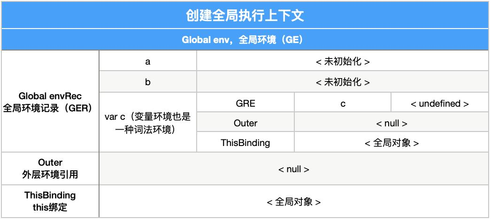
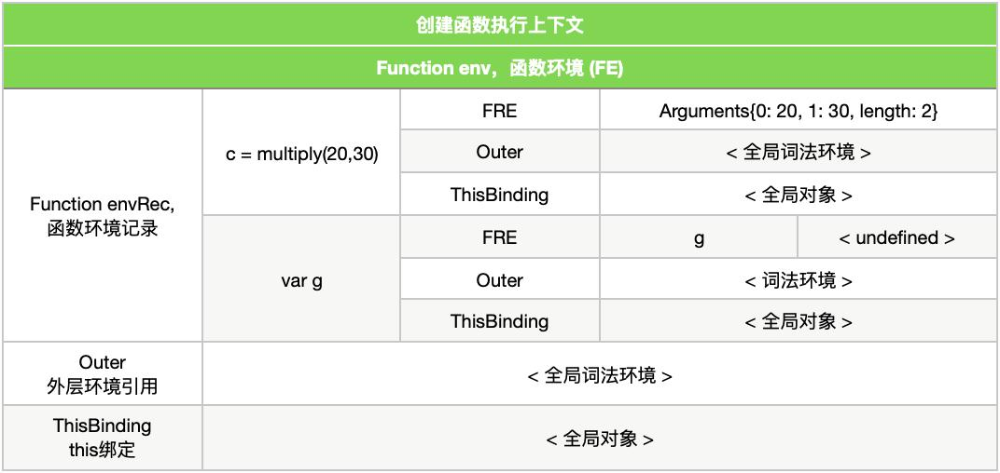

# 执行上下文和栈的解析
## 示例代码源代码如下

### 源代码：
```
let a = 20;
const b = 30;
var c;
function multiply(e, f) {
  var g = 20;
  return e * f * g;
}
c = multiply(20, 30);
```

### 解析阶段一：
```
let a = 20;
const b = 30;
var c;
```


##### 1.当代码运行时,JavaScript引擎会先创建一个全局执行上下文来执行全局代码创建全局上下文,如下：
##### 注: 变量环境也是一种词法环境
```
全局执行上下文 = {
  词法环境: {
    环境记录: {
    //标识绑定符
    Type: "Object",

    //创建的时候并不会初始化
    a: < 未初始化 >,
    b: < 未初始化 >,
    multiply: < func >
  }
  //outer是根据当前所在作用域所确定
  outer: < null >,

  //全局执行上下文的this为null
  ThisBinding: < 全局对象 >
},
  变量环境: {
    环境记录: {
      Type: "Object",

      //var在创建执行文时为undefined（已初始化，但未定义）
      c: undefined,
    }
    outer: < null >,
    ThisBinding: < 全局对象 >
  }
}
```

##### 2.当全局上下文创建完毕后，代码开始执行，此时，变量赋值完成,如下：
```
全局执行上下文 = {
  词法环境: {
    环境记录: {
    //标识绑定符
    Type: "Object",

    //执行时，变量赋值完成
    a: 20,
    b: 30,
    multiply: < func >
  }
  //outer是根据当前所在作用域所确定
  outer: < null >,

  //全局执行上下文的this为null
  ThisBinding: < 全局对象 >
},
  变量环境: {
    环境记录: {
      Type: "Object",

      //var在创建执行文时为undefined（已初始化，但未定义）
      c: undefined,
    }
    outer: < null >,
    ThisBinding: < 全局对象 >
  }
}
```

### 解析阶段二：
```
function multiply(e, f) {
  var g = 20;
  return e * f * g;
}
c = multiply(20, 30);
```


##### 1.当遇到调用函数 multiply(20, 30) 时，就创建一个新的函数执行上下文来执行该函数代码,如下：
##### 注：Arguments对象内会包含所有参数，并包含一个length来统计数组长度(仅对于函数代码有Arguments对象)
```
函数执行上下文 = {
  词法环境: {
    环境记录: {
      Type: "Declarative",
      Arguments:{0: 20,1: 30, length: 2},
      },
      outer: < 全局词法环境 >
      ThisBinding: < 全局对象或者undefined >
    },
    变量环境: {
      环境记录: {
        Type: "Declarative",
        g: undefined
      },
      outer: < 全局词法环境 >,
    ThisBinding: < 全局对象或者undefined >
  }
}
```

##### 2.之后，该执行上下文进入执行阶段，也就是说，该函数内的变量赋值已经完成,如下:
```
函数执行上下文 = {
  词法环境: {
    环境记录: {
      Type: "Declarative",
      Arguments:{0: 20,1: 30, length: 2},
      },
      outer: < 全局词法环境 >
      ThisBinding: < 全局对象或者undefined >
    },
    变量环境: {
      环境记录: {
      Type: "Declarative",
      g: 20
    },
    outer: < 全局词法环境 >,
    ThisBinding: < 全局对象或者undefined >
  }
}
```

##### 3.该函数执行完成后，返回值被存储在 c 中。于是，全局词法环境就被更新了。之后，全局代码完成执行，程序结束.


### 完整流程如下：
