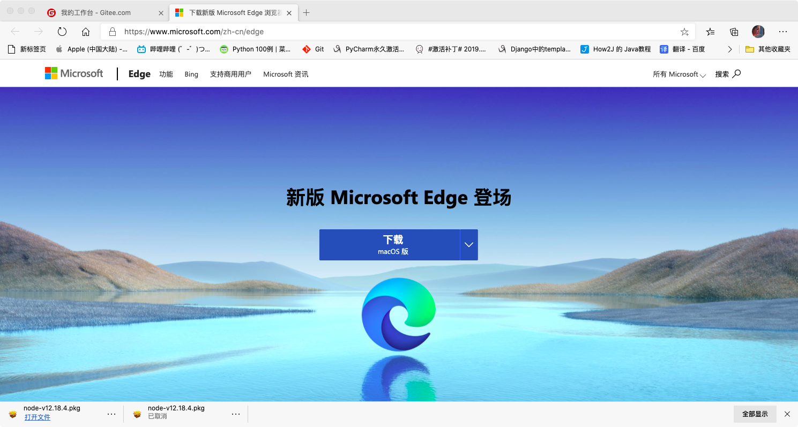
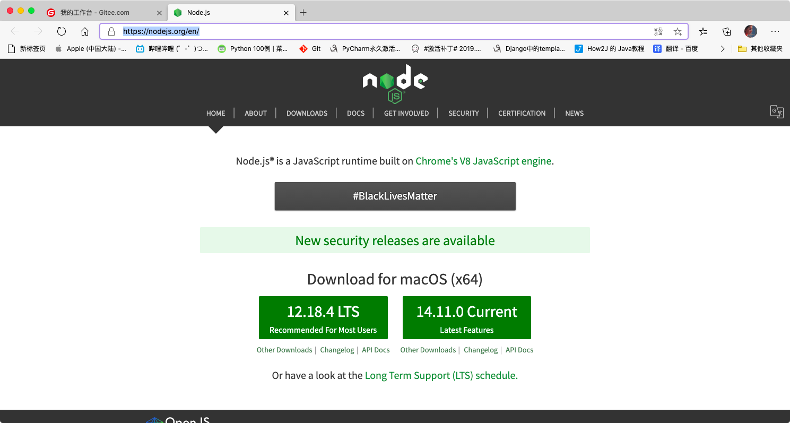
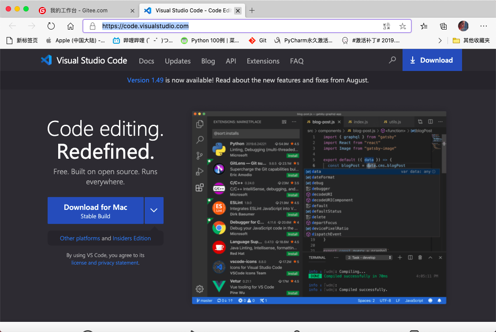
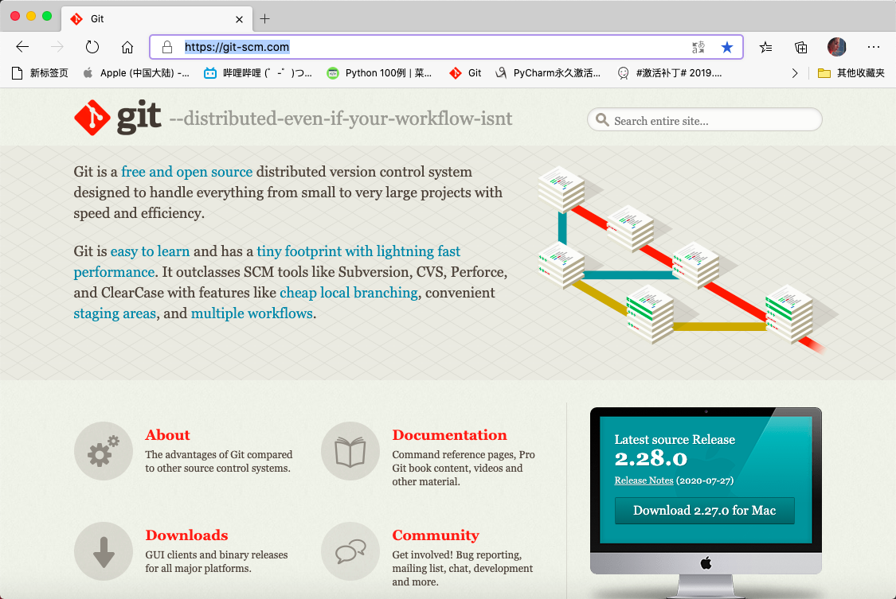

# 						前端环境的搭建

## 一、浏览器的安装

1.浏览器的选择，可以选择Google Chrome、Microsoft Edge 、Mozilla Firefox浏览器作为开发所使用的浏览器，这里我选择的是Microsoft Edge作为开发浏览器。

2.安装步骤

​	2.1下载浏览器

进入Micorsoft Edge 官网下载浏览器的安装包，地址：https://www.microsoft.com/zh-cn/edge



​	2.2下载完成之后进行安装即可


## 二、Node的安装与验证

1Node的下载

​	1.1进入Node的官网，下载Node的安装包，地址：https://nodejs.org/en/


​	1.2按照安装器的指引进行安装操作


2.Node的验证Node的安装是否成功

​	2.1在终端验证

​			输入

```
node -v
```

与

```
npm -v
```

验证是否安装成功，如出现下图则为成功


​	2.2在网页验证

​			2.2.1在终端新建一个helloword.js记事本。命令：

```
vim helloword.js 
```

​			2.2.2输入以下代码进行保存：

​			

```
	var http = require('http');

​				var data = {key:'value',hello:'hello'};

​				var srv = http.createServer(function(req,res){

​				res.writeHead(200,{'Content-type':'application/json'});

​				res.end(JSON.stringify(data));

​				});

​				srv.listen(8080,function(){

​				console.log('listening on localhost:8080');

​				});
```


​	2.2.3执行以下代码：

```
node helloword.js
```


​	2.2.4打开以下页面验证：http://127.0.0.1:8080/


## 三、Visual Studio的安装与插件的安装

1.Visual Studio的安装

​	1.1在Visual Studio的官网下载Visual Studio的安装包，地址：https://code.visualstudio.com/


​	1.2按照安装器的引导进行安装即可 

2.插件的安装

  2.1在Visual Studio内搜索需要的插件进行安装即可（注：有的插件需要重启Visual Studio才能生效）


## 四、Git的安装

1.安装

​	1.1在Git官网下载Git的安装包，地址：https://git-scm.com/


​	1.2按照安装器指引进行安装即可

2.配置Git

​	2.1配置个人信息

```
git config --global user.name "Your Name" 

git config --global user.email "email@example.com"
```

​	2.2创建版本库

```
git init 

ls -ha
```


完）